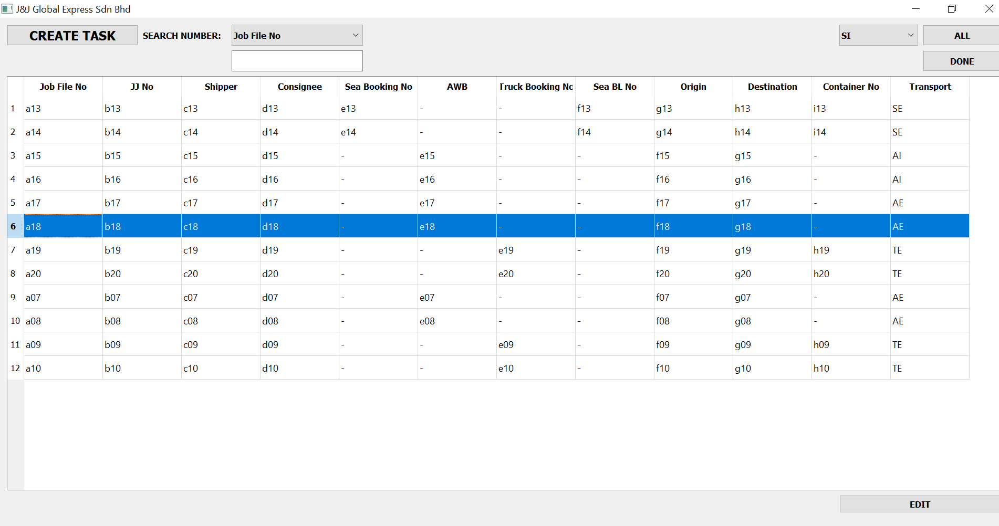

# Logistics Job File Search

The logistics area consists of three main sections which are sea, air and truck.
This program is used to store and search the logistics documnets easily. Thus, this allows user has easy access to previous logistics information 

# Searching the logistics documents

# Upload the sea information

# Upload the air information

# Upload the truck information

